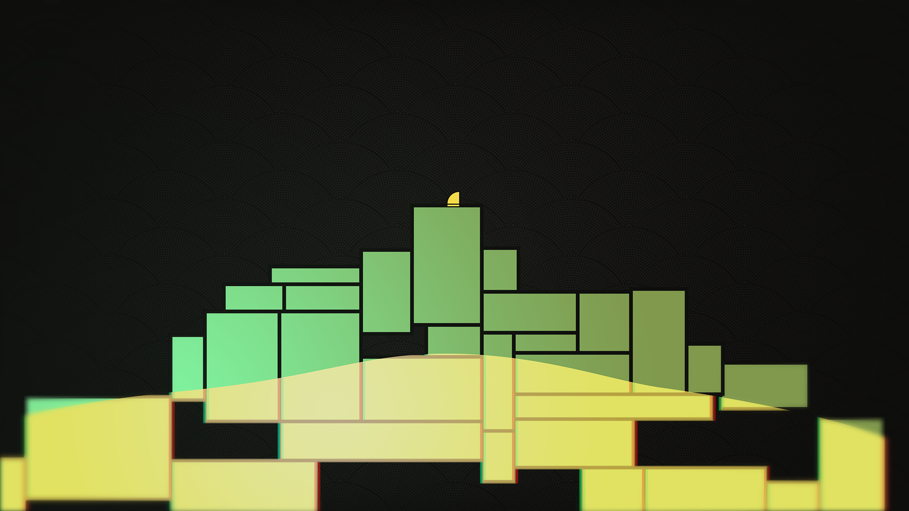

### Hi there 👋
I am a software developer currently based in Tunisia. I love video games, history, books, and music obviously. I have a wide range of skills in many programming languages but recently I've dwelling more in JS (React) but I'll be going back and improving some springboot projects soon.

